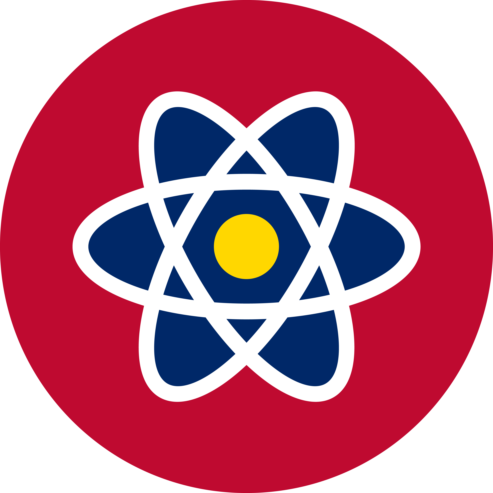
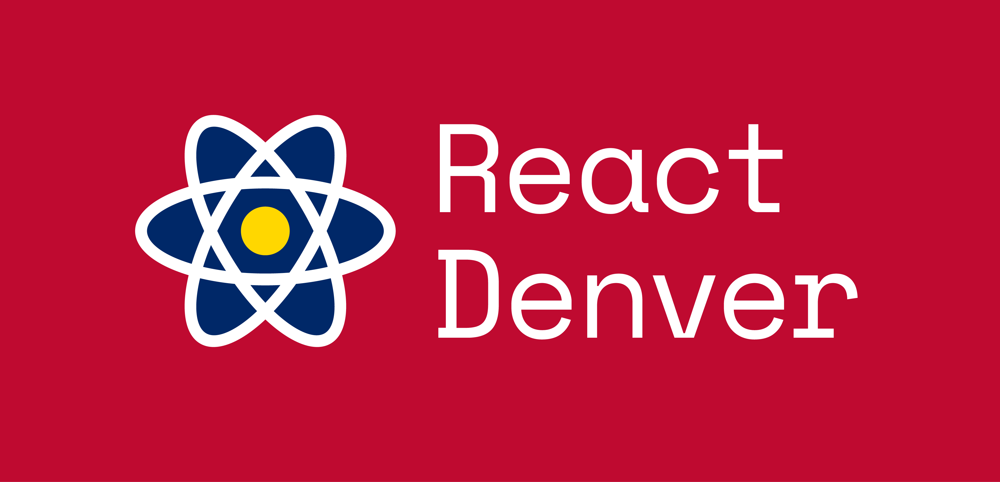

# Help wanted!
React Denver needs your help creating a new logo. We're excited to see what the community can come up with and what the community votes on!

## [@jsejcksn](https://github.com/jsejcksn)'s submission

Alan's vexillology approach was inspirational for my submission.

### Logo

> The negative space below the atom mimics a mountain peak from the Denver flag. Pretty cool, right?

### Logo with type on non-white background

> Space Mono is pretty hot now (like React), but can be substituted in the future if necessary.

## Guidelines
The following are some rough guidelines for what we're looking for in a logo for React Denver.

1. A symbol for Denver
2. A symbol for React
3. We'd like to stick with the blues & darker colors typically associated with React branding. However, we're open to other color schemes.

## How it works

Open a PR to replace the already amazing logo you see here in the README. The community will have the chance to upvote the logos they like the most. The winner will get a free shirt & sticker pack with the selected logo.
