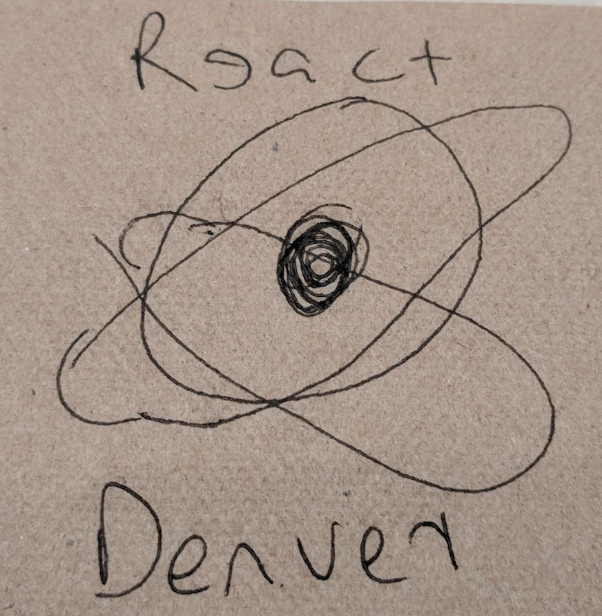

# logo-competition
A transparent competition for React Denver’s new logo. We're excited to see what the community can come up with and what the community votes on!

## Guidelines
The following are some rough guidelines for what we're looking for in a logo for React Denver.

1. A symbol for Denver
2. A symbol for React
3. We'd like to stick with the blues & darker colors typically associated with React branding. However, we're open to all kinds of colors.

## How it works

Open a PR to replace the already amazing logo you see here in the README. The community will have the chance to upvote the logos they like the most. The winner will get a free shirt & sticker pack with the selected logo.