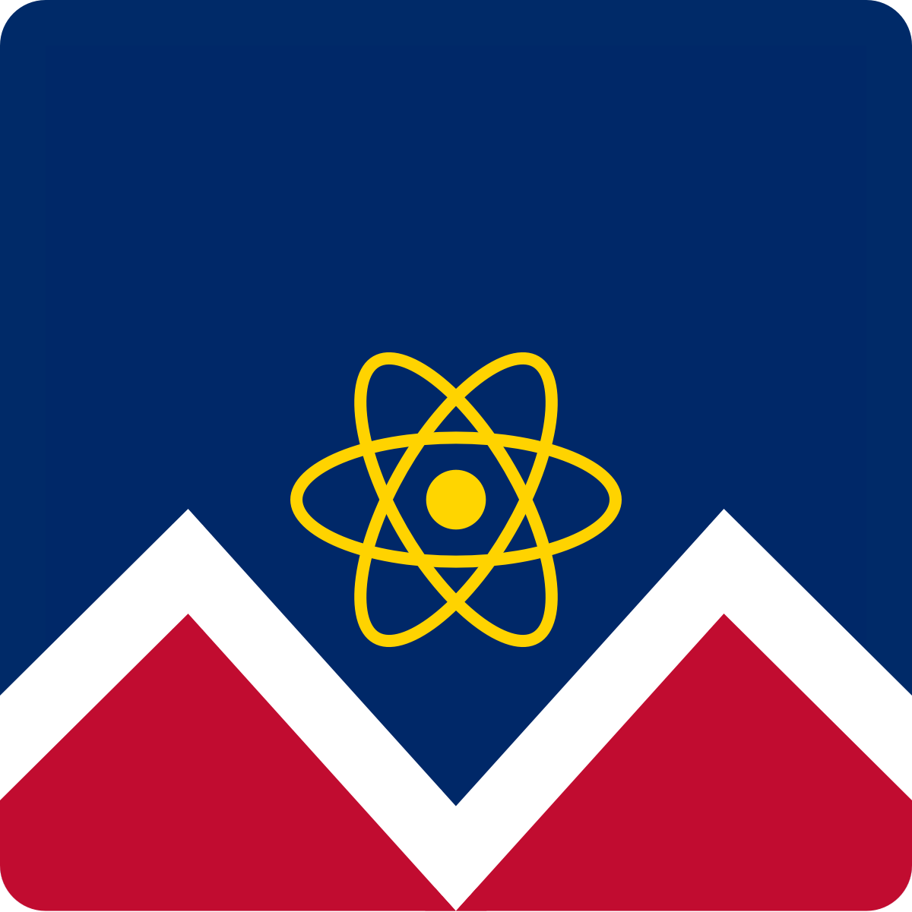
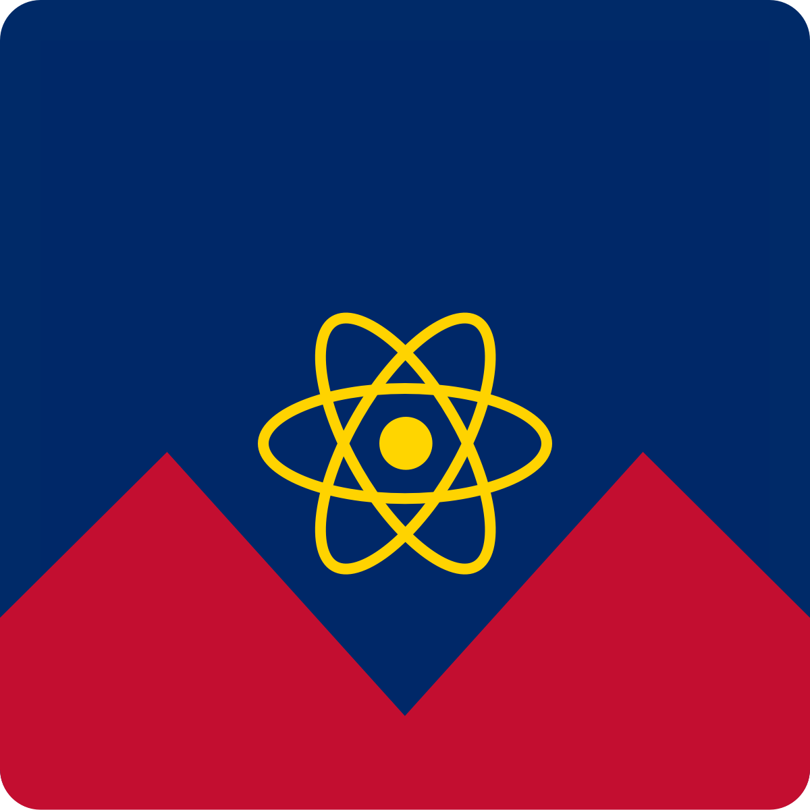
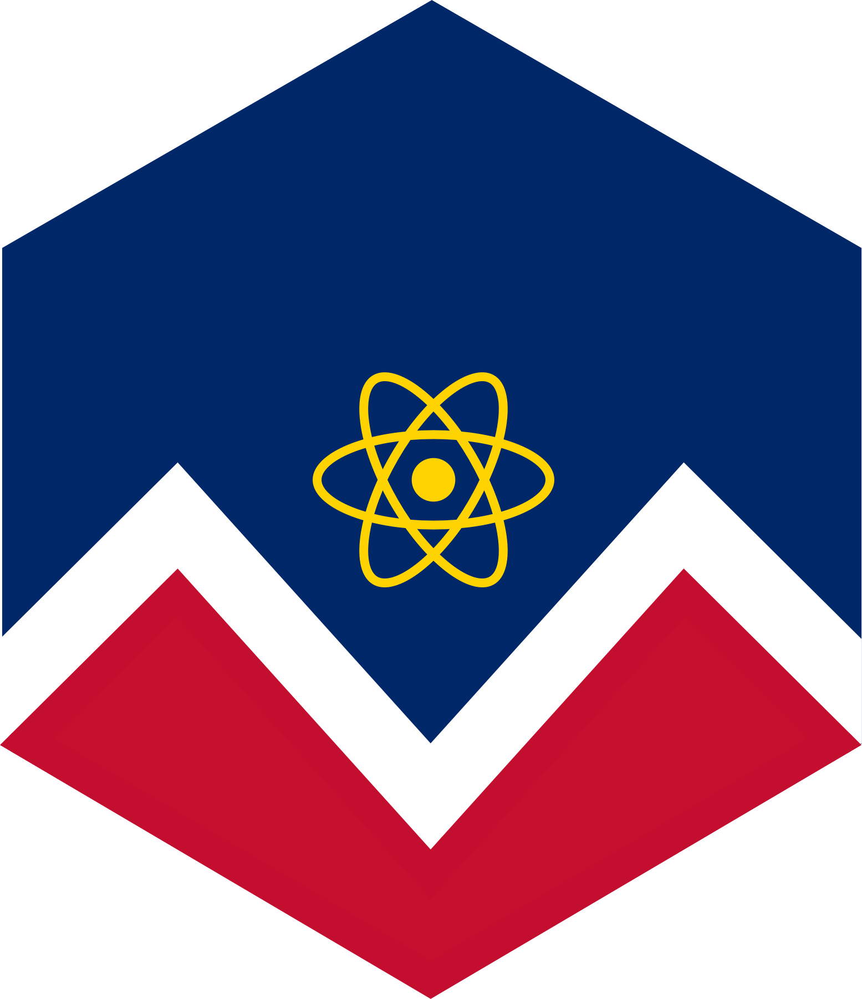
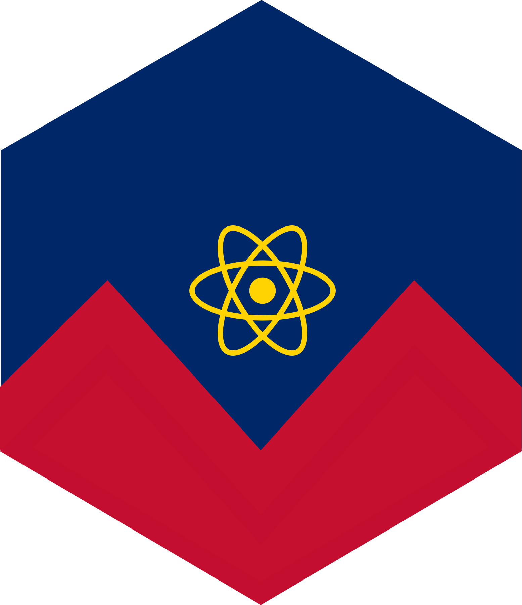

# Help wanted!
React Denver needs your help creating a new logo. We're excited to see what the community can come up with and what the community votes on!

## Alan B Smith Submissions
### Flag of Denver + React Logo - LG - Yellow & Blue

### Flag of Denver + React Logo - LG - Blue

### Flag of Denver + React Logo - LG - Yellow

### Flag of Denver + React Logo - SM - Yellow & Blue

### Flag of Denver + React Logo - SM - Blue

### Flag of Denver + React Logo - SM - Yellow

### Flag of Denver + React Logo - Minimal - Yellow & Red

### Flag of Denver + React Logo - Minimal - Blue Outline

### Flag of Denver + React Logo - Minimal - Yellow & Blue

### Flag of Denver + React Logo - Minimal - Blue Solid

### Flag of Denver + React Logo - Hexagon - Yellow, Red & White

### Flag of Denver + React Logo - Hexagon - Yellow & Red

## Guidelines
The following are some rough guidelines for what we're looking for in a logo for React Denver.

1. A symbol for Denver
2. A symbol for React
3. We'd like to stick with the blues & darker colors typically associated with React branding. However, we're open to other color schemes.

## How it works

Open a PR to replace the already amazing logo you see here in the README. The community will have the chance to upvote the logos they like the most. The winner will get a free shirt & sticker pack with the selected logo.
