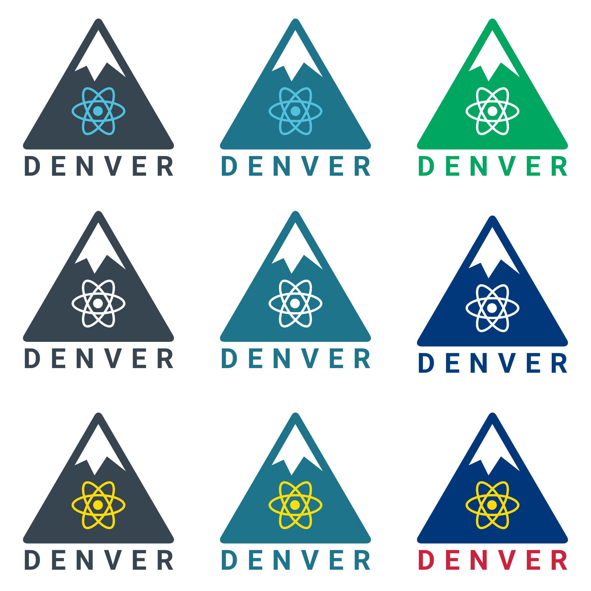
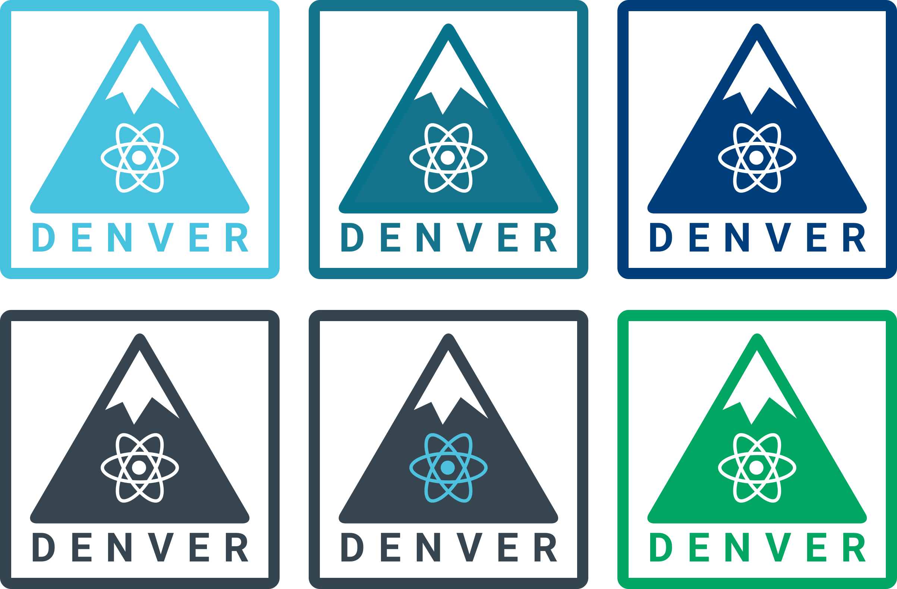
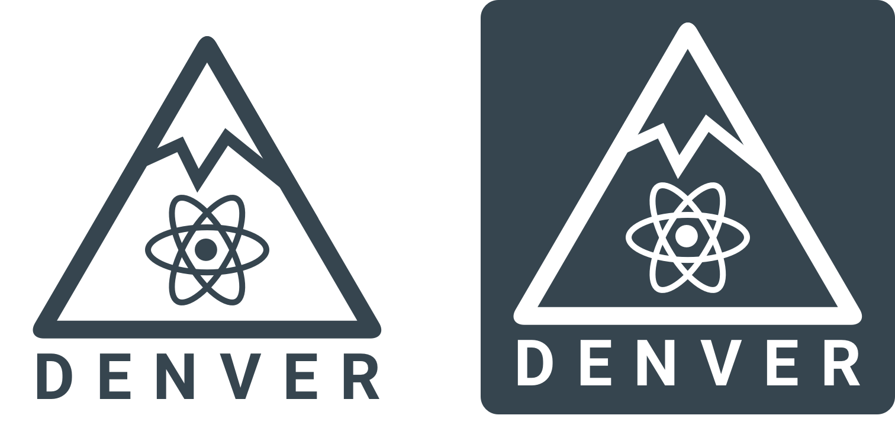

# Help wanted!
React Denver needs your help creating a new logo. We're excited to see what the community can come up with and what the community votes on!

## Alan B Smith & Gabriel Konkle Submissions
I decided to bundle all these together to make them easier to see.

### Set of Nine (no border)

Names are listed from top-left to bottom:

1. Charcoal Mountain - Blue Atom
2. Charcoal Mountain - White Atom
3. Charcoal Mountain - Yellow Atom
4. Slate Blue Mountain - Blue Atom
5. Slate Blue Mountain - White Atom
6. Slate Blue Mountain - Yellow Atom
7. Green Mountain - White Atom
8. Colorado Blue Mountain - White Atom
9. Colorado Blue Mountain - Yellow Atom (Colorado Flag Theme)

### Set of Six (with border)

Names are listed from top-left to right:

1. React Blue Mountain - White Atom
2. Slate Blue Mountain - White Atom
3. Colorado Blue Mountain - White Atom
4. Charcoal Mountain - White Atom
5. Charcoal Mountain - Blue Atom
6. Green Mountain - White Atom

### Set of Two (hollow versions)

1. Hollow Charcoal Icon
2. Hollow Charcoal Reverse Icon

## Guidelines
The following are some rough guidelines for what we're looking for in a logo for React Denver.

1. A symbol for Denver
2. A symbol for React
3. We'd like to stick with the blues & darker colors typically associated with React branding. However, we're open to other color schemes.

## How it works

Open a PR to replace the already amazing logo you see here in the README. The community will have the chance to upvote the logos they like the most. The winner will get a free shirt & sticker pack with the selected logo.
